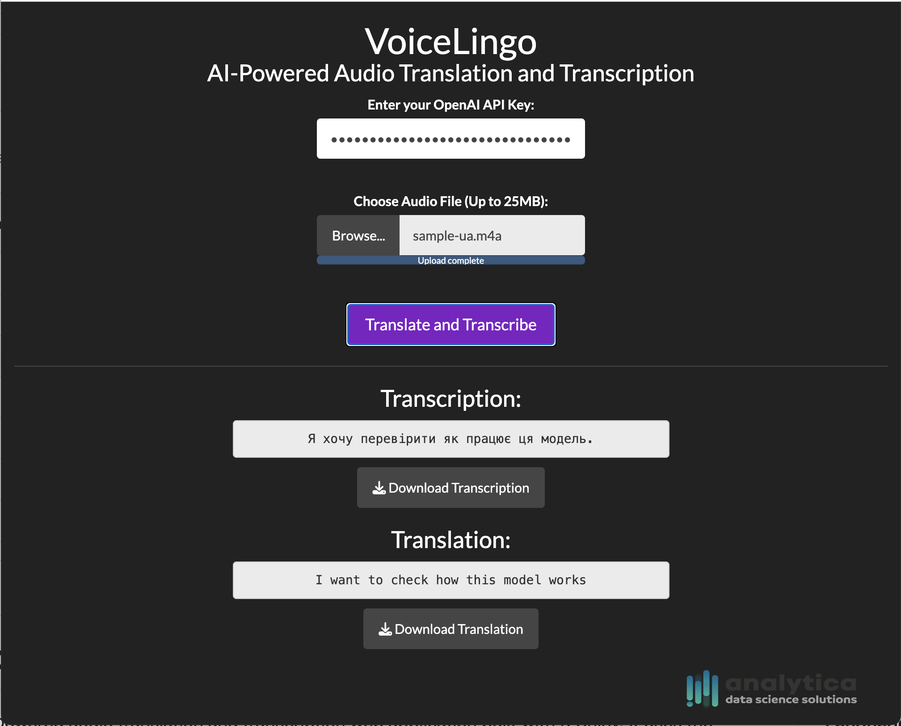

# VoiceLingo

VoiceLingo is an AI-powered audio translation and transcription web application built with R Shiny. It uses the OpenAI Whisper ASR (Automatic Speech Recognition) model to transcribe and translate audio files.

## Features

- Transcribe audio files using OpenAI Whisper ASR
- Translate transcribed text
- Download transcription and translation as text files
- Supports various audio formats (mp3, mp4, mpeg, m4a, wav, webm)

## Prerequisites

To run the VoiceLingo application, you need to have R and the following R packages installed:

- shiny
- shinythemes
- shinyjs
- openai

## Usage

1. Clone this repository or download the source code:
   `git clone https://github.com/aousabdo/voicelingo`
2. Open the `app.R` file in RStudio or another R IDE.
3. Install the required packages if you haven't already: 
    `install.packages(c("shiny", "shinythemes", "shinyjs", "openai"))`
4. Run the `app.R` file in RStudio or your R IDE.
5. The application should open in your default web browser.
6. Enter your OpenAI API Key and upload an audio file.
7. Click the "Translate and Transcribe" button to process the audio file.
8. The transcription and translation will be displayed below the button, and you can download them as text files.

## Note

This application requires an OpenAI API Key, which you can obtain by signing up for an account at [https://www.openai.com](https://www.openai.com).

## License

This project is licensed under the [MIT License](LICENSE).

